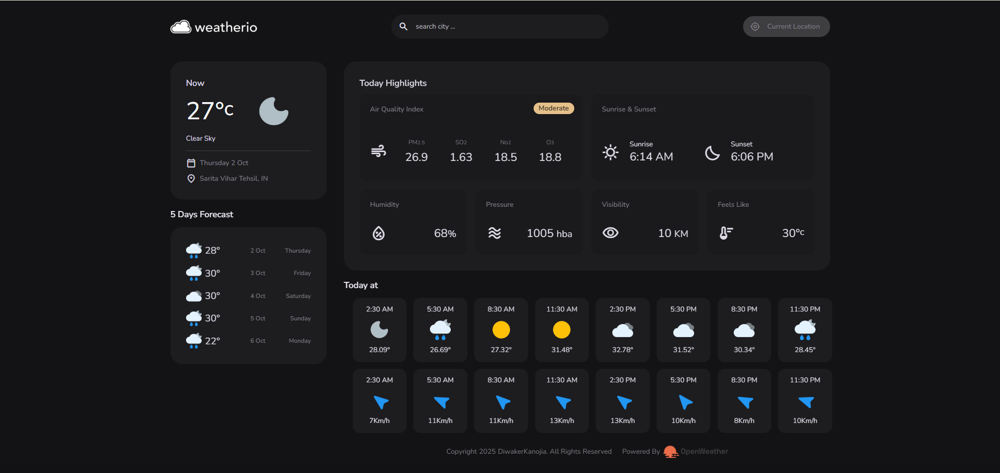

# Weatherio 🌦️

A modern and responsive weather dashboard built using **HTML, CSS, and JavaScript**.

## 🚀 Features

- Real-time weather data using **OpenWeather API**
- Current temperature, humidity, pressure, visibility, and “feels like” values
- **Air Quality Index** with pollutants (PM2.5, SO2, NO2, O3)
- **Sunrise & Sunset times**
- **5-day forecast** with daily weather conditions
- **Hourly forecast** (temperature + wind speed)
- Location-based weather (with search functionality)
- Fully responsive and dark-themed UI

## 🛠️ Tech Stack

  <br>
   <br>

  <br>


## 📸 Screenshots



## ⚡ How to Run

1. Clone the repository
   ```bash
   git clone https://github.com/your-username/weatherio.git
